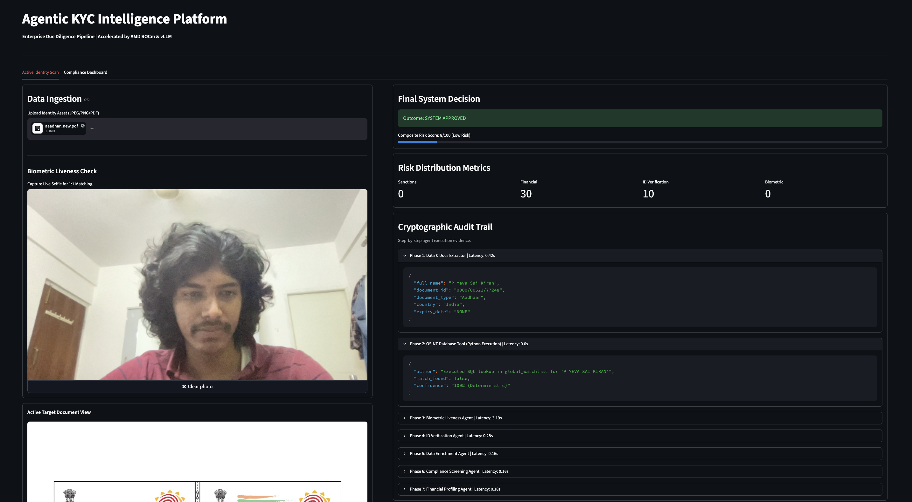
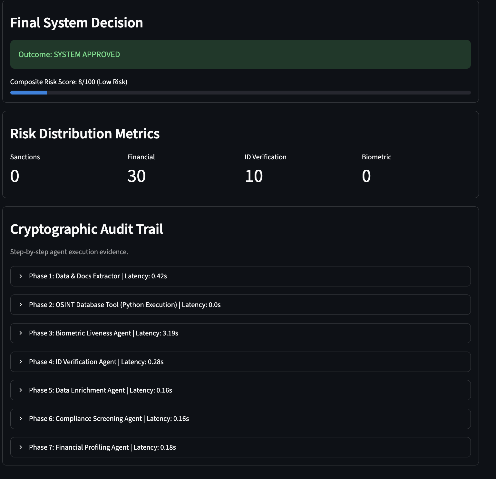
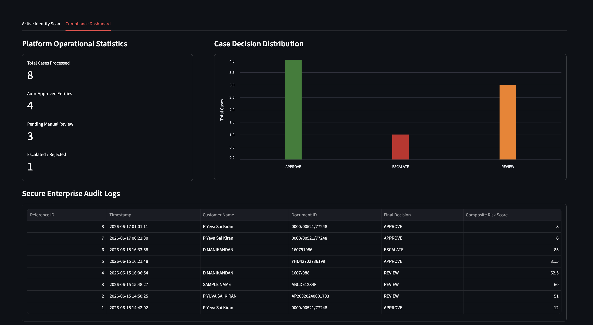

# Agentic KYC Intelligence Platform

An AI-powered KYC verification platform that automates document extraction, identity verification, watchlist screening, biometric face matching, and risk assessment using Agentic AI. The platform uses Qwen 2.5 Vision Language Model running on vLLM to analyze identity documents and generate compliance decisions such as APPROVE, REVIEW, or ESCALATE.

## Installation

### Step 1: Start vLLM Server

```bash
vllm serve Qwen/Qwen2.5-VL-7B-Instruct \
  --port 8000 \
  --gpu-memory-utilization 0.5
```

### Step 2: Install System Dependencies

```bash
apt-get update && apt-get install -y \
cmake \
build-essential \
g++ \
libopenblas-dev \
liblapack-dev \
poppler-utils
```

### Step 3: Install Python Dependencies

```bash
pip install streamlit \
face_recognition \
opencv-python-headless \
qwen-vl-utils \
Pillow \
pdf2image \
--ignore-installed blinker
```

### Step 4: Run the Application

```bash
streamlit run app.py
```

## Features

- Document Data Extraction
- Identity Verification
- Watchlist Screening
- Biometric Face Matching
- Financial Risk Profiling
- Compliance Risk Assessment
- Audit Trail Logging
- Compliance Dashboard

## Tech Stack

### Frontend
- Streamlit

### AI / LLM
- Qwen2.5-VL-7B-Instruct
- vLLM

### Computer Vision
- Face Recognition
- OpenCV
- Pillow

### Data Processing
- PDF2Image
- Pandas

### Database
- SQLite

### Visualization
- Altair

### Infrastructure
- Python
- AMD ROCm


## Screenshots

### Home Page



### Verification Results



### Compliance Dashboard

